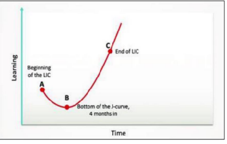

# Find the Passion
* **Description**: To explain about the, what's the passion, How to find the passion and building the passion.

* **Passion**: If you feel joy and love when you think, understand, or work for a long time, that is a passionate field for you.

* **Find the Passion**: No shortcuts for finding the passion. But using the scientific method called the J-curve or learning curve, it is possible to create a passion for a specific field. To do this, first choose a field of interest and you will feel happy at first because you are interested in this field. However, when you realize that there is a lot to learn in this field, you will feel pressured and frustrated as to whether you will be able to complete it. If you overcome this and work hard and acquire the necessary knowledge and practice, that field will become very simple and easy. This will lead to happiness in that field and a love for that field.

**J Curve or Learning Curve**

